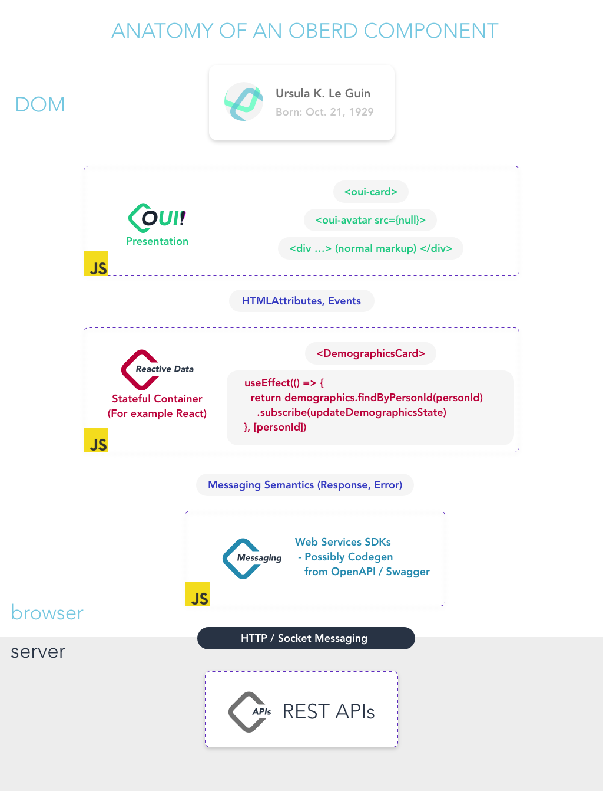

### Usage

Install the repo

`git clone git@github.com:oberd/oui.git "$OBERD_DEV_ROOT"/oui`

Include in your package.json

```json
{
    "dependencies": {
        "@oberd/oui": "file:../oui"
    }
}
```

Run NPM install

`npm i`

Register the web-components with the DOM, and include the types in your typescript for JSX (for example if you want to use them from a React app)

```typescript
// for example: src/globals.ts

// Registers all @oberd/oui with the dom, and augments
// the JSX intrinsic elements type to include our custom elements
// generated from @oberd/oui

import { defineCustomElements, JSX as LocalJSX } from "@oberd/oui/loader"
import { HTMLAttributes } from "react"

type StencilToReact<T> = {
  [P in keyof T]?: T[P] & Omit<HTMLAttributes<Element>, "className"> & {
    class?: string;
  };
}

declare global {
  export namespace JSX {
    interface IntrinsicElements extends StencilToReact<LocalJSX.IntrinsicElements> {
    }
  }
}

defineCustomElements(window)
```

In React (for example)

```tsx
import React from "react"

export function MyConsumer() {
  return (
    <oui-card>
      <oui-button color="blue">Bonjour, oui!</oui-button>
    </oui-card>
  )
}
```


### Bigger Picture



### Roadmap

This repository is intended to provide standardized styling of UI widgets and common patterns in Oberd and Oberd related views.

Good components to add:
  - Common widgets such as dropdowns, menus, app bars

Good components to have in your app:
  - Anything touching APIs (these components should be backend agnostic)

<!--- autogenerated do not edit after this line --->

## Components

> **Note:** Do not add your component here manually.
> To generate this component list run &nbsp; `$ npm run build`

* [card](src/components/card/readme.md)
* [card-heading](src/components/card-heading/readme.md)
* [documents-icon](src/components/documents-icon/readme.md)
* [file-upload](src/components/file-upload/readme.md)
* [file-upload-modal](src/components/file-upload-modal/readme.md)
* [svg](src/components/svg/readme.md)
