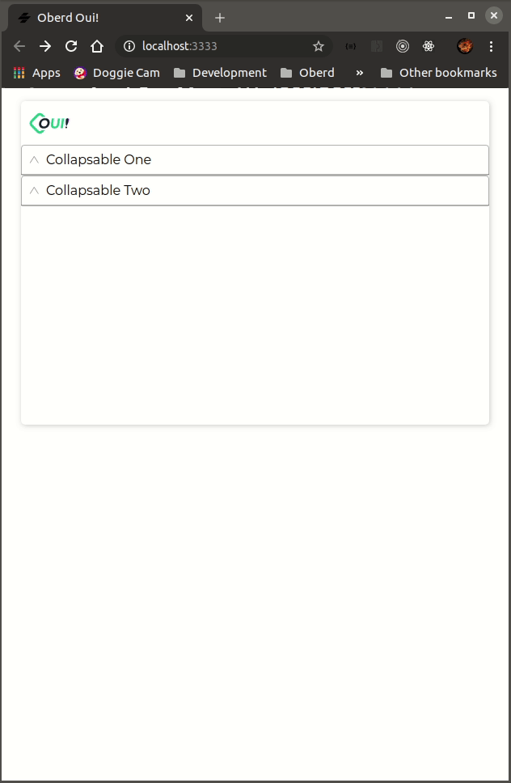

# oui-accordion

Accordion web component. Use with muliple `oui-collapsable` components. When one collapsable label is expanded, accordion collapses any other label that is expanded. Needs to have more than two collapsable components with different named labels to be useful.



## Usage
```html
<!-- accordion web component -->
  <oui-accordion>
    <oui-collapsable label="Collapsable One">
      <p>
          Lorem ipsum dolor sit amet, consectetur adipiscing elit, sed do eiusmod tempor incididunt ut labore et dolore magna aliqua. Ut enim ad minim veniam, quis nostrud e
      </p>
    </oui-collapsable>
    <oui-collapsable label="Collapsable Two">
      <p>
          entore veritatis et quasi architecto beatae vitae dicta sunt explicabo. Nemo enim ipsam voluptatem quia voluptas sit aspernatur aut odit aut fugit, sed
      </p>
    </oui-collapsable>
  </oui-accordion>

```

<!-- Auto Generated Below -->


----------------------------------------------

*Built with [StencilJS](https://stenciljs.com/)*
