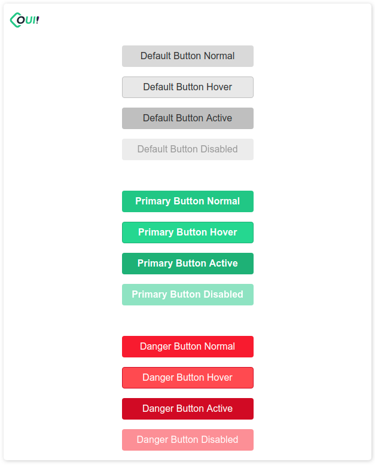

# oui-button

<!-- Auto Generated Below -->

## Properties

| Property   | Attribute  | Description                        | Type      | Default |
| ---------- | ---------- | ---------------------------------- | --------- | ------- |
| `danger`   | `danger`   | Set danger status of the button.   | `boolean` | `false` |
| `disabled` | `disabled` | Set disabled status of the button. | `boolean` | `false` |
| `primary`  | `primary`  | Set primary status of the button.  | `boolean` | `false` |

----------------------------------------------

*Built with [StencilJS](https://stenciljs.com/)*
