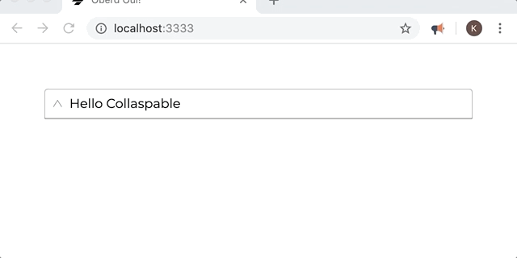
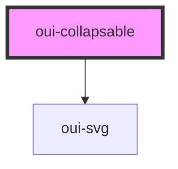

# oui-collapsable

Collapsable web component. Click on the label to expand content, click again to collapse content. Can be manually overwrite by setting the `expanded` prop to `true` or `false`. It emits `collapse` and `expand` events that can be use to react to user interaction.



## Usage

```html
<oui-collapsable label="Hello Collapsable">
  <oui-drawer-item label="www.google.com" link="https://google.com"><oui-drawer-item>
  <oui-drawer-item lable="callback link"><oui-drawer-item>
</oui-collapsable>
```

<!-- Auto Generated Below -->


## Properties

| Property   | Attribute  | Description                          | Type      | Default     |
| ---------- | ---------- | ------------------------------------ | --------- | ----------- |
| `expanded` | `expanded` | Set drawer position to right or left | `boolean` | `false`     |
| `label`    | `label`    | Set drawer drawerTitle               | `string`  | `undefined` |


## Events

| Event      | Description                     | Type               |
| ---------- | ------------------------------- | ------------------ |
| `collapse` | Triggered when item collaspes   | `CustomEvent<any>` |
| `expand`   | Triggered when the item expands | `CustomEvent<any>` |


## Dependencies

### Depends on

- [oui-svg](../svg)

### Graph


----------------------------------------------

*Built with [StencilJS](https://stenciljs.com/)*
