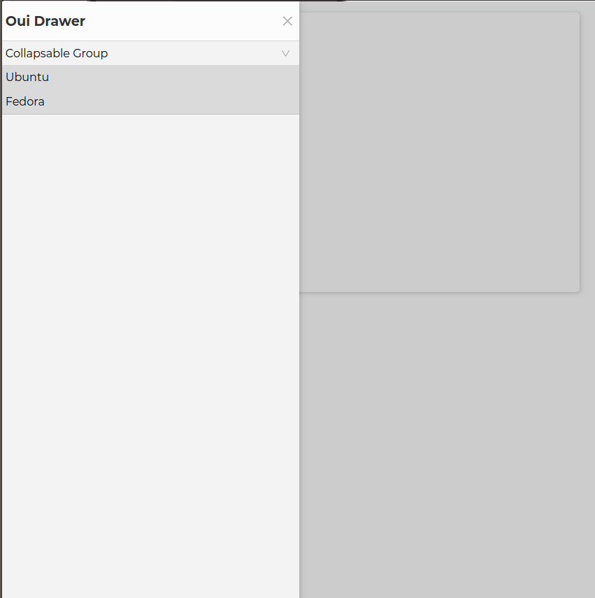
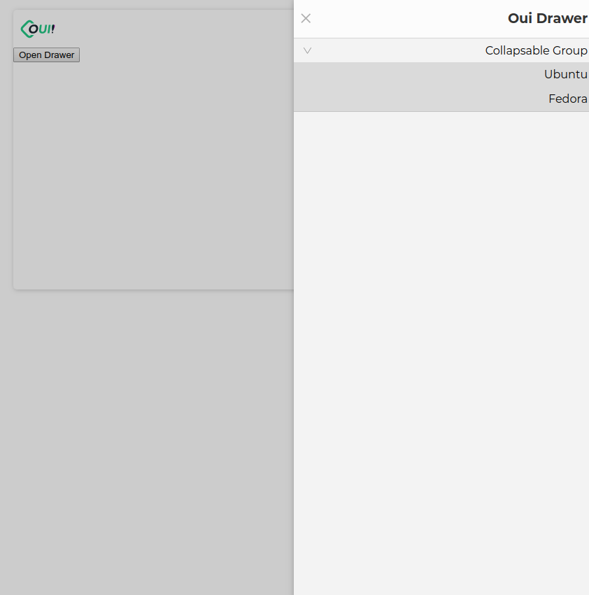

# oui-drawer-item

A container for links or clickable elements to be used by the `oui-drawer` component. It inherit position styling from the drawer. If the `link` prop is passed it will use an `a` tag, and optionally the `external` boolean props can be set to set the `target="_blank"` and  `rel="noopener noreferrer"` attributes of the link. If `link` is not set the content of the label is wrapped in a plain `span` tag and events can be assigned as normal to the host element. e.g. `document.querySelector('oui-drawer-item').addEventListener('click', (evt) => console.log(evt.target))`



> Parent drawer position set to right



```html
<oui-drawer drawer-title="Oui Drawer" size="50%">
  <oui-collapsable label="Collapsable Group">
    <oui-drawer-item label="Ubuntu" link="https://ubuntu.com"></oui-drawer-item>
    <oui-drawer-item label="Fedora" link="https://getfedora.org"></oui-drawer-item>
  </oui-collapsable>
</oui-drawer>
```

<!-- Auto Generated Below -->


## Properties

| Property   | Attribute  | Description                                                                                  | Type      | Default     |
| ---------- | ---------- | -------------------------------------------------------------------------------------------- | --------- | ----------- |
| `external` | `external` | Open link in a new tab. Only for links                                                       | `boolean` | `undefined` |
| `label`    | `label`    | Set drawer item label                                                                        | `string`  | `undefined` |
| `link`     | `link`     | Set drawer item link if string will be treated as a url or as a callback if it is a function | `string`  | `undefined` |


----------------------------------------------

*Built with [StencilJS](https://stenciljs.com/)*
