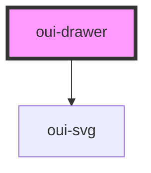

# nav-drawer

<!-- Auto Generated Below -->

## Properties

| Property      | Attribute      | Description                          | Type      | Default     |
| ------------- | -------------- | ------------------------------------ | --------- | ----------- |
| `drawerTitle` | `drawer-title` | Set drawer drawerTitle               | `string`  | `undefined` |
| `opened`      | `opened`       | Open and close drawer                | `boolean` | `undefined` |
| `position`    | `position`     | Set drawer position to right or left | `string`  | `"left"`    |
| `size`        | `size`         | Set drawer size                      | `string`  | `"auto"`    |

## Events

| Event   | Description                     | Type               |
| ------- | ------------------------------- | ------------------ |
| `close` | Triggered when the drawer close | `CustomEvent<any>` |
| `open`  | Triggered when the drawer open  | `CustomEvent<any>` |

## Dependencies

### Depends on

- [oui-svg](../svg)

### Graph

----------------------------------------------

*Built with [StencilJS](https://stenciljs.com/)*
