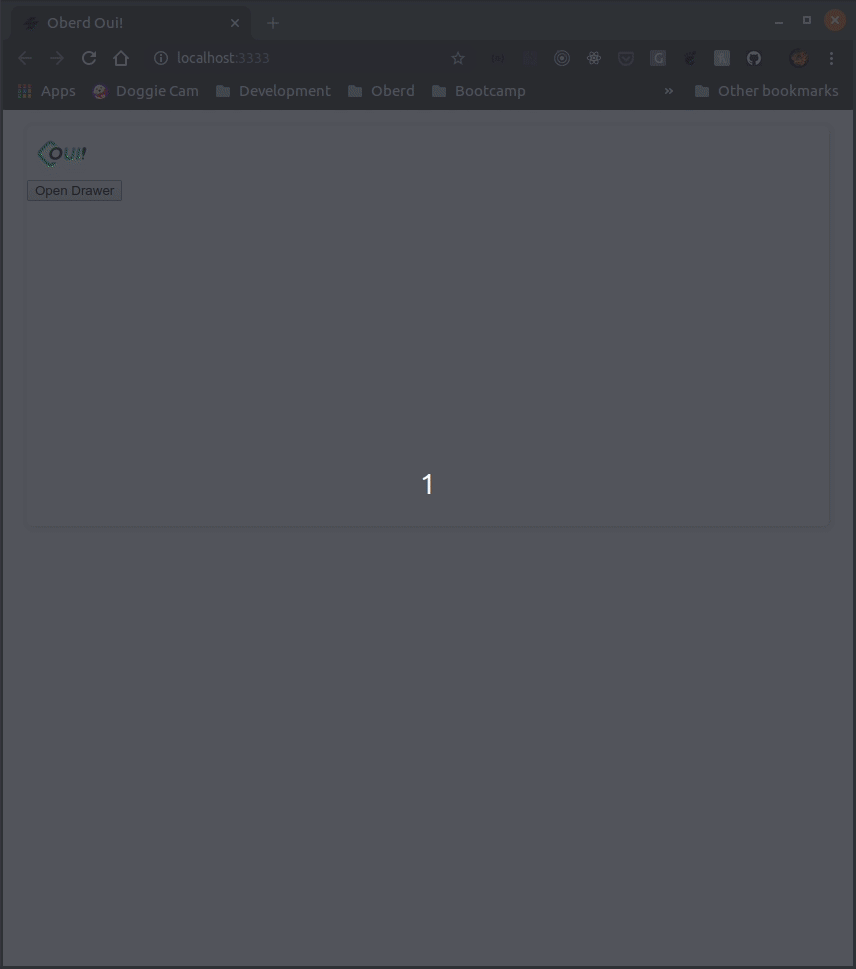
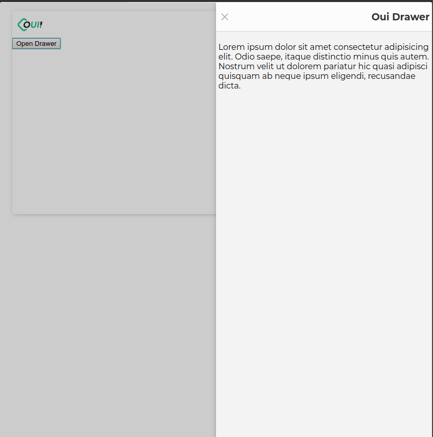
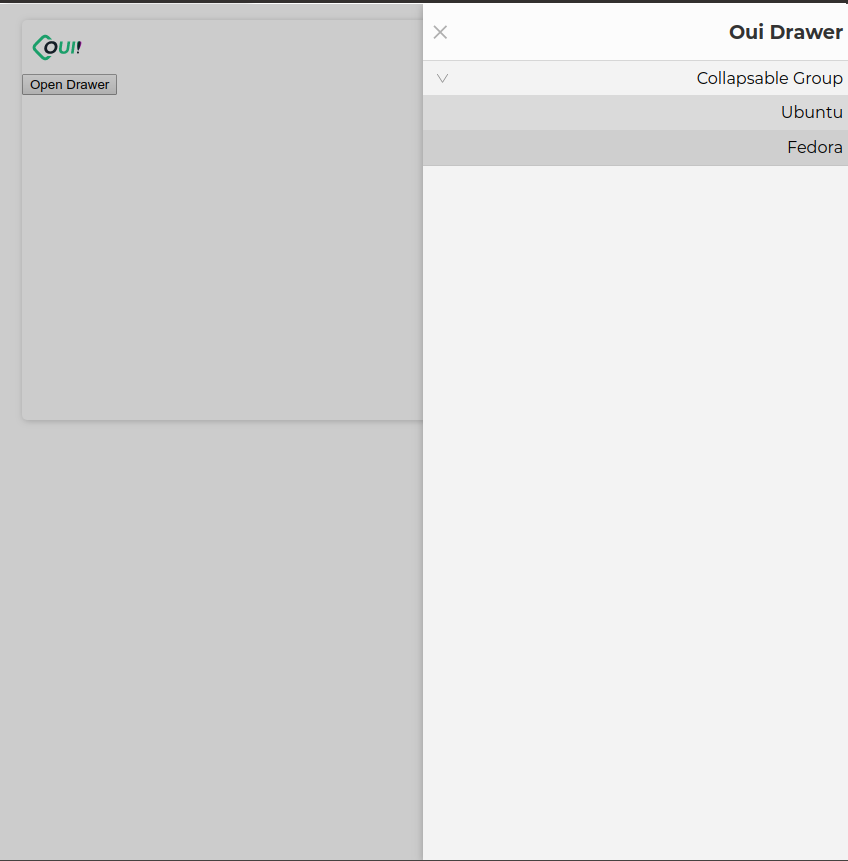
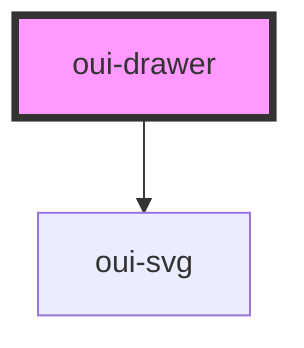

# oui-drawer

A plain drawer that will render HTML or oui-drawer elements. Closable by clicking on the close button, the backdrop or by setting the prop opened to `false`. It also emits 'close' and 'open' events that can be used to react to the user iteraction. By defult the size is set to auto and will expand to fit the content width, but it can be overwrited by passing the desired widht to the size prop with the unit (e.g. size="20em").



## Usage

```html
<button id="open-drawer">Open Drawer</button>

<oui-drawer drawer-title="Oui Drawer" size="50%">
  <p>
    Lorem ipsum dolor sit amet consectetur adipisicing elit. Odio saepe,
    itaque distinctio minus quis autem. Nostrum velit ut dolorem pariatur
    hic quasi adipisci quisquam ab neque ipsum eligendi, recusandae dicta.
  </p>
</oui-drawer>

<script>
  document
    .querySelector("#open-drawer")
    .addEventListener('click', () => {
      document.querySelector('oui-drawer').opened = true
    })
</script>
```

--------

> Postion prop set to right




-----

## Used with `oui-collapsable` and `oui-drawer-item`

When used with `oui-collapsable` and `oui-drawer-item` the children will inherit some styling. e.g. will swap alingment on when position is set to right.



## Usage

```html
    <oui-drawer drawer-title="Oui Drawer" size="50%" position="right">
      <oui-collapsable label="Collapsable Group">
        <oui-drawer-item label="Ubuntu" link="https://ubuntu.com"></oui-drawer-item>
        <oui-drawer-item label="Fedora" link="https://getfedora.org"></oui-drawer-item>
      </oui-collapsable>
    </oui-drawer>
```

<!-- Auto Generated Below -->


## Properties

| Property      | Attribute      | Description                          | Type      | Default     |
| ------------- | -------------- | ------------------------------------ | --------- | ----------- |
| `drawerTitle` | `drawer-title` | Set drawer drawerTitle               | `string`  | `undefined` |
| `opened`      | `opened`       | Open and close drawer                | `boolean` | `undefined` |
| `position`    | `position`     | Set drawer position to right or left | `string`  | `"left"`    |
| `size`        | `size`         | Set drawer size                      | `string`  | `"auto"`    |


## Events

| Event   | Description                     | Type               |
| ------- | ------------------------------- | ------------------ |
| `close` | Triggered when the drawer close | `CustomEvent<any>` |
| `open`  | Triggered when the drawer open  | `CustomEvent<any>` |


## Dependencies

### Depends on

- [oui-svg](../svg)

### Graph


----------------------------------------------

*Built with [StencilJS](https://stenciljs.com/)*
