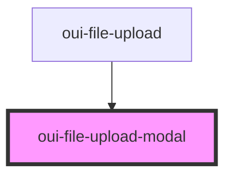

# oui-file-upload-modal

<!-- Auto Generated Below -->

## Events

| Event   | Description                                    | Type               |
| ------- | ---------------------------------------------- | ------------------ |
| `close` | Emitted when modal is closed via button or esc | `CustomEvent<any>` |

## Dependencies

### Used by

 - [oui-file-upload](../file-upload)

### Graph

----------------------------------------------

*Built with [StencilJS](https://stenciljs.com/)*
