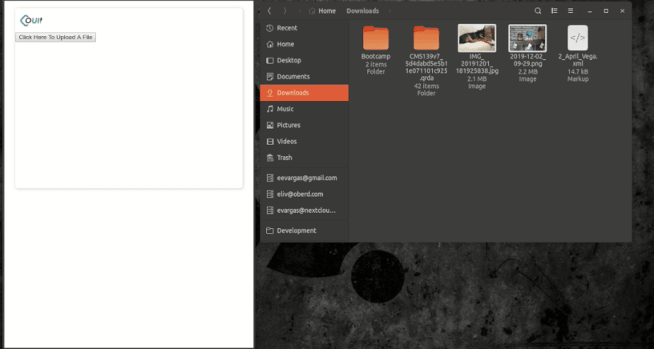
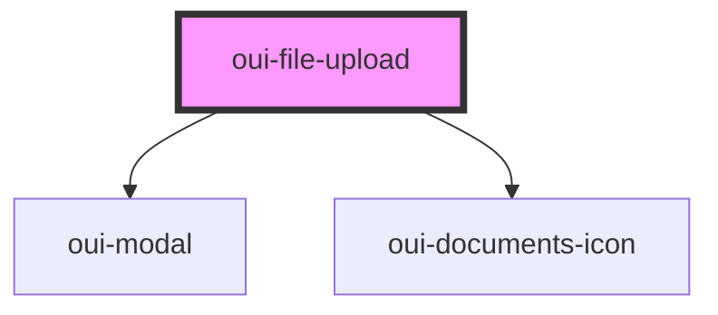

# oui-file-upload

Upload files by drag and drop



## Usage
```html
<!-- File Upload Dialog Dropper -->
<oui-file-upload
  id="files"
  accept="text/xml"
  btn-label="Click Here To Upload A File"
  modal-title="Oui File Upload"
></oui-file-upload>

<script>
  document
    .querySelector("#files")
    .addEventListener("dropped", async (event) => {
      const postResponse = await event.detail.uploadWith(async (formData) => {
        const url = "https://httpbin.org/status/" + (Math.random() > 0.3 ? "200" : "400")
        const response = await fetch(url, {
          method: "POST",
          body: formData,
        })

        if (!response.ok) {
          throw new Error("problem uploading files.")
        }

        return response.status + " " + response.statusText
      })

      console.log("Uploaded files: " + postResponse)
    })
</script>
```


<!-- Auto Generated Below -->


## Properties

| Property     | Attribute     | Description                                                                                                  | Type     | Default                   |
| ------------ | ------------- | ------------------------------------------------------------------------------------------------------------ | -------- | ------------------------- |
| `accept`     | `accept`      | Specify mime types to accept (unrestricted by default) Separate by spaces for multiple: `text/html text/xml` | `string` | `FileSelectEvent.acceptAll` |
| `btnLabel`   | `btn-label`   | Specify a label for the button.                                                                              | `string` | `"Upload"`                |
| `modalTitle` | `modal-title` | Specify a title for the modal.                                                                               | `string` | `"Upload Files"`          |


## Events

| Event     | Description                                                                                      | Type                         |
| --------- | ------------------------------------------------------------------------------------------------ | ---------------------------- |
| `dropped` | Files dropped onto page, and validated. You can use this event to perform an upload in javscript | `CustomEvent<FileSelectEvent>` |


## Dependencies

### Depends on

- [oui-modal](../modal)
- [oui-documents-icon](../documents-icon)

### Graph


----------------------------------------------

*Built with [StencilJS](https://stenciljs.com/)*
