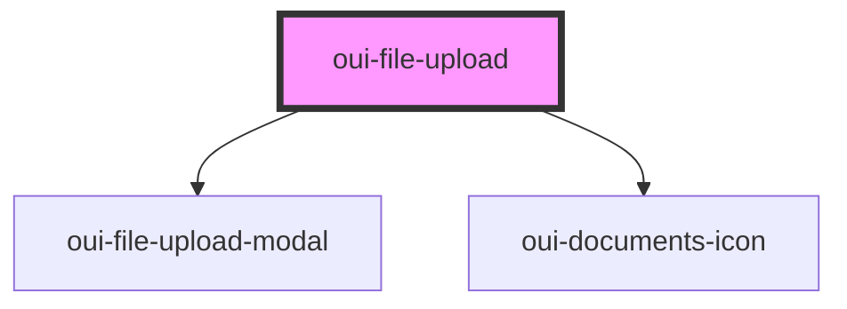

# oui-file-upload

```html
<!-- File Upload Dialog Dropper -->
<oui-file-upload id="files" accept="text/xml"></oui-file-upload>
<script>
  const el = document.getElementById("files")
  let counter = 0
  el.addEventListener("dropped", (event) => {
    event.detail.uploadWith((formData) => {
      return new Promise((resolve, reject) => {
        counter++
        if (counter % 2 === 0) {
          setTimeout(() => resolve(), 3000)
          return
        }
        setTimeout(() => reject("problem with upload"), 3000)
      })
    })
  })
</script>
```


<!-- Auto Generated Below -->


## Properties

| Property      | Attribute      | Description | Type      | Default     |
| ------------- | -------------- | ----------- | --------- | ----------- |
| `accept`      | `accept`       |             | `string`  | `undefined` |
| `isUploading` | `is-uploading` |             | `boolean` | `false`     |


## Events

| Event     | Description | Type                           |
| --------- | ----------- | ------------------------------ |
| `dropped` |             | `CustomEvent<FileUploadEvent>` |


## Dependencies

### Depends on

- [oui-file-upload-modal](../file-upload-modal)
- [oui-documents-icon](../documents-icon)

### Graph


----------------------------------------------

*Built with [StencilJS](https://stenciljs.com/)*
