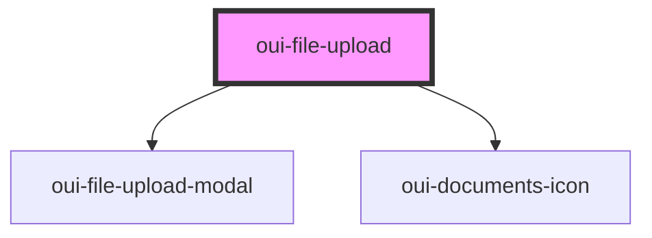

# oui-file-upload

```html
<!-- File Upload Dialog Dropper -->
<oui-file-upload id="files" accept="text/xml"></oui-file-upload>
<script>
  document.getElementById("my-files")
    .addEventListener("dropped", (fileUploadEvent) => {
        const response = fileUploadEvent.detail.uploadWith(async (formData) => {
            const response = await fetch("/my-url", { body: formData })
            if (!response.ok) {
                throw new Error("problem during upload")
            }
            return response.json()
        })
        console.log("Uploaded Files (response: %s)", JSON.stringify(response))
  })
</script>
```


<!-- Auto Generated Below -->


## Properties

| Property      | Attribute      | Description | Type      | Default     |
| ------------- | -------------- | ----------- | --------- | ----------- |
| `accept`      | `accept`       |             | `string`  | `undefined` |
| `isUploading` | `is-uploading` |             | `boolean` | `false`     |


## Events

| Event     | Description | Type                           |
| --------- | ----------- | ------------------------------ |
| `dropped` |             | `CustomEvent<FileUploadEvent>` |


## Dependencies

### Depends on

- [oui-file-upload-modal](../file-upload-modal)
- [oui-documents-icon](../documents-icon)

### Graph


----------------------------------------------

*Built with [StencilJS](https://stenciljs.com/)*
