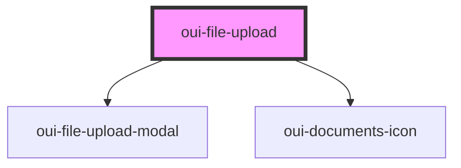

# oui-file-upload

Upload files by drag and drop


## Usage
```html
<!-- File Upload Dialog Dropper -->
<oui-file-upload id="files" accept="text/xml"></oui-file-upload>
<script>
  const el = document.getElementById("files")
  el.addEventListener("dropped", async (event) => {
    const postResponse = await event.detail.uploadWith(async (formData) => {
      const url = "https://httpbin.org/status/" + (Math.random() > 0.3 ? "200" : "400")
      const response = await fetch(url, {
        method: "POST",
        body: formData,
      })
      if (!response.ok) {
        throw new Error("problem uploading files.")
      }
      return response.status + " " + response.statusText
    })
    console.log("Uploaded files: " + postResponse)
  })
</script>
```


<!-- Auto Generated Below -->


## Properties

| Property | Attribute | Description                                                                                                  | Type     | Default                   |
| -------- | --------- | ------------------------------------------------------------------------------------------------------------ | -------- | ------------------------- |
| `accept` | `accept`  | Specify mime types to accept (unrestricted by default) Separate by spaces for multiple: `text/html text/xml` | `string` | `FileDropEvent.acceptAll` |


## Events

| Event     | Description                                                                                      | Type                         |
| --------- | ------------------------------------------------------------------------------------------------ | ---------------------------- |
| `dropped` | Files dropped onto page, and validated. You can use this event to perform an upload in javscript | `CustomEvent<FileDropEvent>` |


## Dependencies

### Depends on

- [oui-file-upload-modal](../file-upload-modal)
- [oui-documents-icon](../documents-icon)

### Graph


----------------------------------------------

*Built with [StencilJS](https://stenciljs.com/)*
