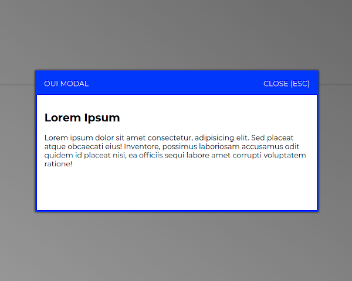
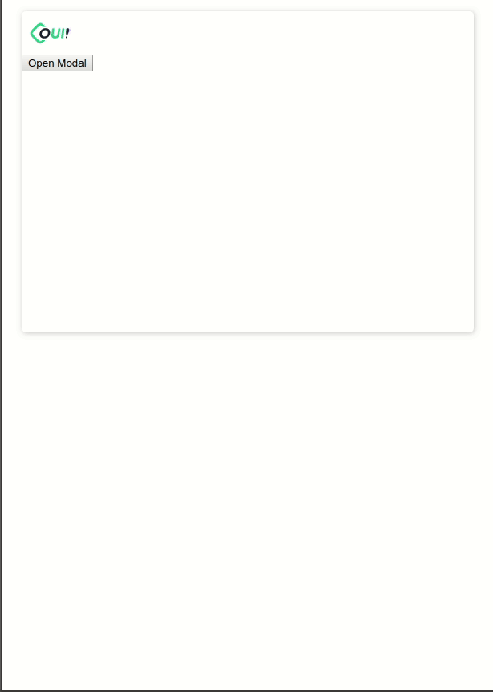
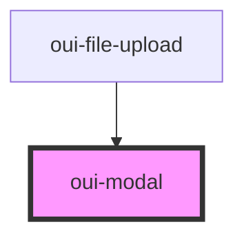

# oui-modal






## Usage

```html
<oui-modal>
  <span slot="title">Oui Modal</span>
  <h1>Lorem Ipsum</h1>
  <p>
    Lorem ipsum dolor sit amet consectetur adipisicing elit. Nam similique, quibusdam aliquid
    officia eveniet, recusandae iste ab cupiditate pariatur accusamus alias ratione provident
    sequi vitae facilis, qui sint fugiat earum?
  </p>
</oui-modal>
```

<!-- Auto Generated Below -->


## Events

| Event   | Description                                    | Type               |
| ------- | ---------------------------------------------- | ------------------ |
| `close` | Emitted when modal is closed via button or esc | `CustomEvent<any>` |


## Dependencies

### Used by

 - [oui-file-upload](../file-upload)

### Graph


----------------------------------------------

*Built with [StencilJS](https://stenciljs.com/)*
