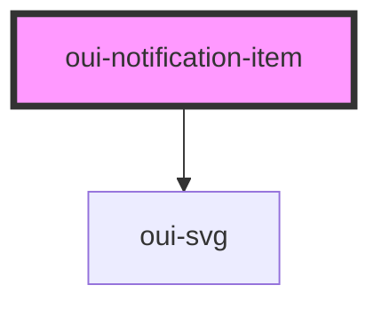

# oui-notification-item

<!-- Auto Generated Below -->

## Properties

| Property  | Attribute | Description                  | Type                  | Default     |
| --------- | --------- | ---------------------------- | --------------------- | ----------- |
| `detail`  | `detail`  | A single noti message        | `string`              | `""`        |
| `read`    | `read`    | A single notification object | `boolean`             | `false`     |
| `title`   | `title`   |                              | `string`              | `""`        |
| `type`    | `type`    |                              | `"info" \| "link"`    | `"link"`    |
| `valence` | `valence` |                              | `"fail" \| "success"` | `"success"` |

## Events

| Event     | Description | Type               |
| --------- | ----------- | ------------------ |
| `dismiss` |             | `CustomEvent<any>` |

## Dependencies

### Depends on

- [oui-svg](../svg)

### Graph

----------------------------------------------

*Built with [StencilJS](https://stenciljs.com/)*
