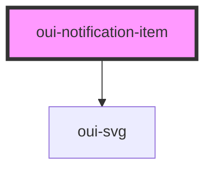

# oui-notification-item

<!-- Auto Generated Below -->

## Properties

| Property  | Attribute | Description                   | Type                  | Default     |
| --------- | --------- | ----------------------------- | --------------------- | ----------- |
| `detail`  | `detail`  | A single notification message | `string`              | `""`        |
| `name`    | `name`    |                               | `string`              | `""`        |
| `read`    | `read`    | A single notification object  | `boolean`             | `false`     |
| `type`    | `type`    |                               | `"info" \| "link"`    | `"link"`    |
| `valence` | `valence` |                               | `"fail" \| "success"` | `"success"` |

## Dependencies

### Depends on

- [oui-svg](../svg)

### Graph

----------------------------------------------

*Built with [StencilJS](https://stenciljs.com/)*
