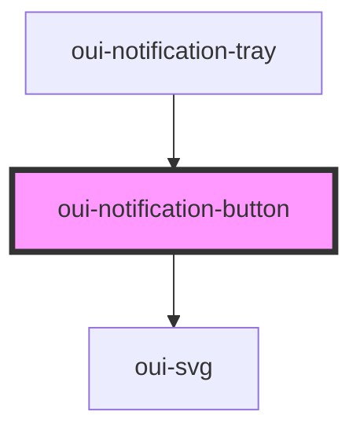

# oui-notification-button

<!-- Auto Generated Below -->

## Properties

| Property | Attribute | Description                    | Type     | Default |
| -------- | --------- | ------------------------------ | -------- | ------- |
| `count`  | `count`   | Number of unread notifications | `number` | `0`     |
| `unread` | `unread`  | Number of unread notifications | `number` | `0`     |

## Dependencies

### Used by

 - [oui-notification-tray](..)

### Depends on

- [oui-svg](../../svg)

### Graph

----------------------------------------------

*Built with [StencilJS](https://stenciljs.com/)*
