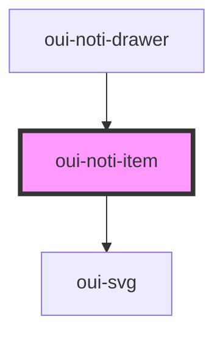

# oui-noti-item

<!-- Auto Generated Below -->

## Properties

| Property  | Attribute | Description           | Type               | Default     |
| --------- | --------- | --------------------- | ------------------ | ----------- |
| `message` | --        | A single noti message | `NotiMessageProps` | `undefined` |
| `read`    | `read`    | A single noti message | `boolean`          | `false`     |

## Events

| Event     | Description | Type               |
| --------- | ----------- | ------------------ |
| `dismiss` |             | `CustomEvent<any>` |

## Dependencies

### Used by

 - [oui-noti-drawer]()

### Depends on

- [oui-svg](../../svg)

### Graph

----------------------------------------------

*Built with [StencilJS](https://stenciljs.com/)*
