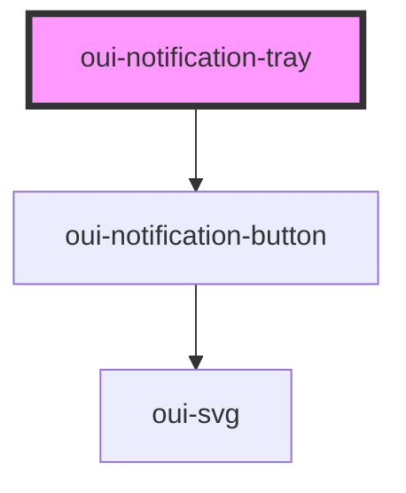

# oui-notification-tray

Notification tray

### Light Theme


### Dark Theme


### States


## Notification Object

```js
interface NotificationProps {
  title: string
  link?: string
  type: "link" | "info"
  detail?: string
  valence: "success" | "fail",
  read?: boolean
}
```

## Usage

```html

  <div style="width: 98%; margin: 4em auto; text-align: center;">
    <oui-tm-switch></oui-tm-switch>
    <oui-nav-bar>
      <div style="flex: 1;"></div>
      <oui-notification-tray>
        <oui-notification-drawer></oui-notification-drawer>
      </oui-notification-tray>
    </oui-nav-bar>
  </div>
  
  <script>
    const notifications = [
      { name: 'Ubuntu Release', type: 'link', detail: 'Ubuntu 19.10 has been released', valence: 'success', read: false },
      { name: 'Apple Release', type: 'info', detail: 'OSX Catalina has been released', valence: 'fail', read: false }
    ]

    console.log(this.event)

    const dismiss = (evt) => {
      alert(`Notification ${evt.detail} has been dismissed`)
      if (tray.count > 0) {
        tray.count--
        console.log(tray.count)
      }
    }

    const dismissAll = (evt) => {
      alert('All notifications have been dismissed')
      if (tray.unread > 0) {
        tray.unread = 0
        console.log(tray.unread)
      }
    }

    const drawer = document.querySelector("oui-notification-drawer")

    const tray = document.querySelector("oui-notification-tray")
    tray.count = notifications.length
    tray.unread = notifications.length

    const notificationsMapper = () => {
        notifications.map((n) => {
          const item = document.createElement("oui-notification-item")
          item.setAttribute("key", n.name)
          item.setAttribute("name", n.name)
          item.setAttribute("type", n.type)
          item.setAttribute("detail", n.detail)
          item.setAttribute("valence", n.valence)
          item.setAttribute("read", n.read)
          drawer.appendChild(item)
        })
      }

    const addingEventListeners = () => {
      drawer.addEventListener('dismiss', dismiss)
      tray.addEventListener('dismissall', dismissAll)
    }

    notificationsMapper()
    addingEventListeners()

  </script>
```


<!-- Auto Generated Below -->


## Properties

| Property    | Attribute   | Description                               | Type                      | Default     |
| ----------- | ----------- | ----------------------------------------- | ------------------------- | ----------- |
| `count`     | `count`     | Total count of the notifications          | `number`                  | `0`         |
| `direction` | `direction` | Direction of the drawer                   | `"to-left" \| "to-right"` | `"to-left"` |
| `opened`    | `opened`    | Open or close the notification drawer     | `boolean`                 | `false`     |
| `unread`    | `unread`    | Total count of notifications left to read | `number`                  | `0`         |


## Events

| Event        | Description                                  | Type                  |
| ------------ | -------------------------------------------- | --------------------- |
| `dismiss`    | Event signifying current event has been read | `CustomEvent<string>` |
| `dismissall` | Event signifying all events have been read   | `CustomEvent<any>`    |


## Dependencies

### Depends on

- [oui-notification-button](button)

### Graph


----------------------------------------------

*Built with [StencilJS](https://stenciljs.com/)*
