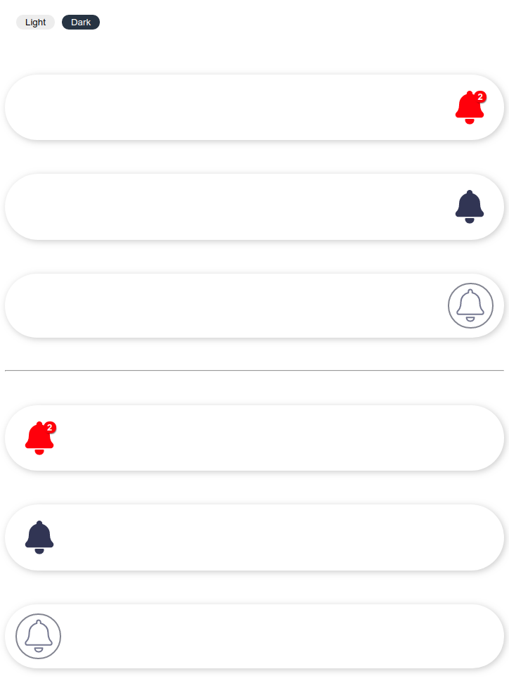
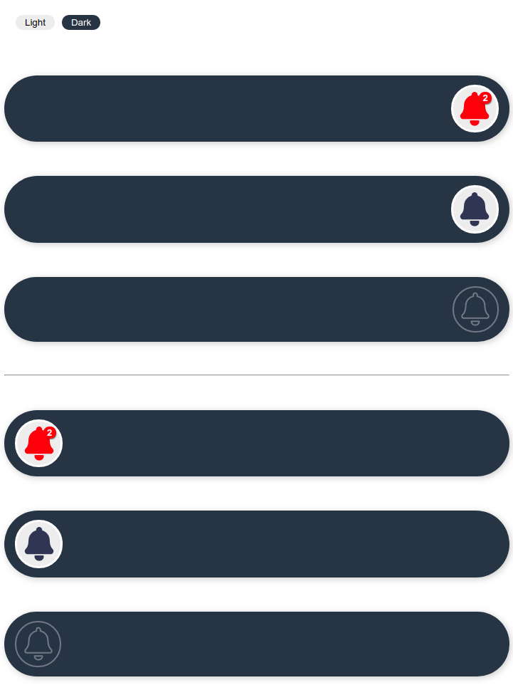
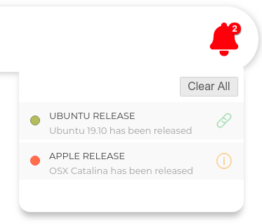
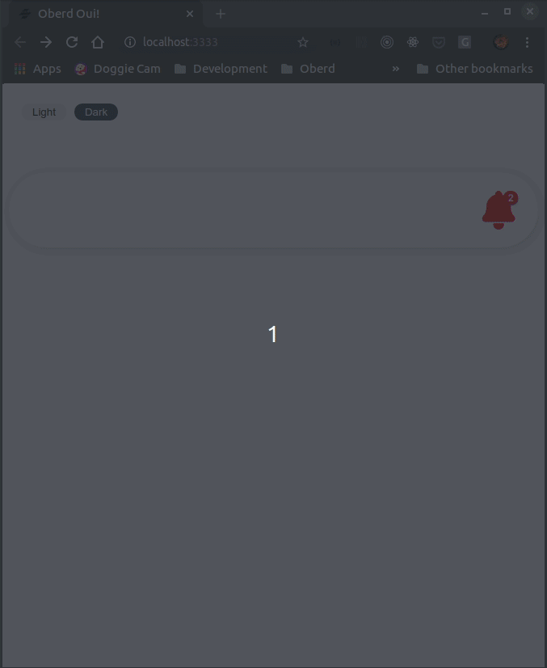
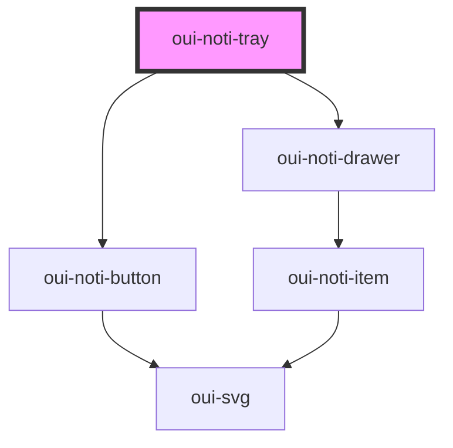

# oui-noti-tray

Notification tray

### Light Theme



### Dark Theme



### States





## Notification Object

```js
interface NotificationProps {
  title: string
  link?: string
  type: "link" | "info"
  detail?: string
  valence: "success" | "fail",
  read?: boolean
}
```

## Usage

```js
<oui-tm-switch></oui-tm-switch>

  <oui-nav-bar>
    <div style="flex: 1;"></div>
    <oui-noti-tray id="noti-one"></oui-noti-tray>
  </oui-nav-bar>

  <script>
    let notifications = [
      {
        title: "Ubuntu Release",
        link: "https://ubuntu.com",
        type: "link",
        detail: "Ubuntu 19.10 has been released",
        valence: "success"
      },
      {
        title: "Apple Release",
        type: "info",
        detail: "OSX Catalina has been released",
        valence: "fail"
      }
    ]

    const notiTrayOne = document.querySelector("#noti-one")
    notiTrayOne.notifications = notifications

    // on single item dismiss event
    document.addEventListener('dismiss', (evt) => {
      notifications = notifications.map((noti) => {
        if (noti.title === evt.detail) { noti.read = true }
        return noti
      })

      notiTrayOne.notifications = notifications
    })

    // on dismiss all event
    document.addEventListener('dismissall', (evt) => {
      notifications = notifications.map((noti) => {
        noti.read = true
        return noti
      })

      notiTrayOne.notifications = notifications
    })
  </script>
```


<!-- Auto Generated Below -->


## Properties

| Property        | Attribute   | Description                           | Type                      | Default     |
| --------------- | ----------- | ------------------------------------- | ------------------------- | ----------- |
| `direction`     | `direction` | Direction of the drawer               | `"to-left" \| "to-right"` | `"to-left"` |
| `notifications` | --          | Array of notification objects         | `NotificationProps[]`     | `[]`        |
| `opened`        | `opened`    | Open or close the notification drawer | `boolean`                 | `false`     |


## Dependencies

### Depends on

- [oui-noti-button](button)
- [oui-noti-drawer](drawer)

### Graph


----------------------------------------------

*Built with [StencilJS](https://stenciljs.com/)*
