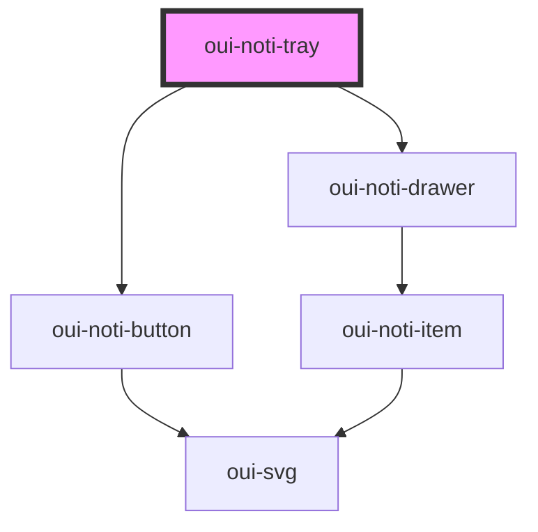

# oui-noti-tray

<!-- Auto Generated Below -->

## Properties

| Property    | Attribute   | Description | Type                      | Default     |
| ----------- | ----------- | ----------- | ------------------------- | ----------- |
| `direction` | `direction` |             | `"to-left" \| "to-right"` | `"to-left"` |
| `messages`  | --          |             | `NotiMessageProps[]`      | `[]`        |
| `opened`    | `opened`    |             | `boolean`                 | `false`     |

## Dependencies

### Depends on

- [oui-noti-button](button)
- [oui-noti-drawer](drawer)

### Graph

----------------------------------------------

*Built with [StencilJS](https://stenciljs.com/)*
