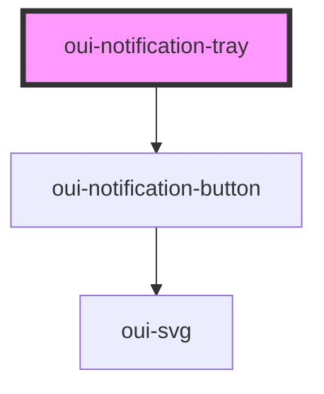

# oui-notification-tray

Notification tray

### Light Theme


### Dark Theme


### States


## Notification Object

```js
interface NotificationProps {
  title: string
  link?: string
  type: "link" | "info"
  detail?: string
  valence: "success" | "fail",
  read?: boolean
}
```

## Usage

```js
  <div style="width: 98%; margin: 4em auto;">
    <oui-tm-switch></oui-tm-switch>
    <oui-nav-bar>
      <div style="flex: 1"></div>
      <oui-notification-tray count="2" unread="2">
        <oui-notification-drawer>
          <oui-notification-item
            name="Ubuntu"
            type="info"
            detail="Ubuntu 20.04 has been released"
            valence="success"
          ></oui-notification-item>
          <oui-notification-item
            name="OSX"
            type="link"
            detail="Catalina has been released"
            valence="fail"
          ></oui-notification-item>
        </oui-notification-drawer>
      </oui-notification-tray>
    </oui-nav-bar>
  </div>
  <script>
    const tray = document.querySelector('oui-notification-tray')
    tray.addEventListener('dismiss', (evt) => {
      console.log('Dismiss ' + evt.detail)
      tray.setAttribute('unread', tray.getAttribute('unread') - 1)
      tray.querySelector('[name='+evt.detail+']').setAttribute('read', '')
    })

    tray.addEventListener('dismissall', (evt) => {
      console.log('Dismiss all')
      tray.querySelectorAll('oui-notification-item')
        .forEach((itm) => itm.setAttribute('read', ''))
      tray.setAttribute('unread', 0)
    })
  </script>
```


<!-- Auto Generated Below -->


## Properties

| Property    | Attribute   | Description                               | Type                      | Default     |
| ----------- | ----------- | ----------------------------------------- | ------------------------- | ----------- |
| `count`     | `count`     | Total count of the notifications          | `number`                  | `0`         |
| `direction` | `direction` | Direction of the drawer                   | `"to-left" \| "to-right"` | `"to-left"` |
| `opened`    | `opened`    | Open or close the notification drawer     | `boolean`                 | `false`     |
| `unread`    | `unread`    | Total count of notifications left to read | `number`                  | `0`         |


## Events

| Event        | Description                                  | Type                  |
| ------------ | -------------------------------------------- | --------------------- |
| `dismiss`    | Event signifying current event has been read | `CustomEvent<string>` |
| `dismissall` | Event signifying all events have been read   | `CustomEvent<any>`    |


## Dependencies

### Depends on

- [oui-notification-button](button)

### Graph


----------------------------------------------

*Built with [StencilJS](https://stenciljs.com/)*
