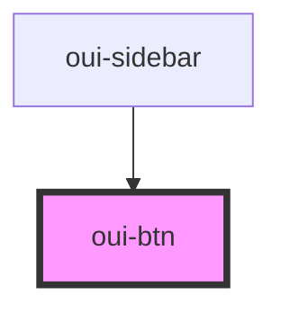

# oui-btn

<!-- Auto Generated Below -->

## Properties

| Property | Attribute | Description | Type                   | Default    |
| -------- | --------- | ----------- | ---------------------- | ---------- |
| `type`   | `type`    |             | `"button" \| "submit"` | `"button"` |

## Dependencies

### Used by

 - [oui-sidebar](../oui-sidebar)

### Graph

----------------------------------------------

*Built with [StencilJS](https://stenciljs.com/)*
