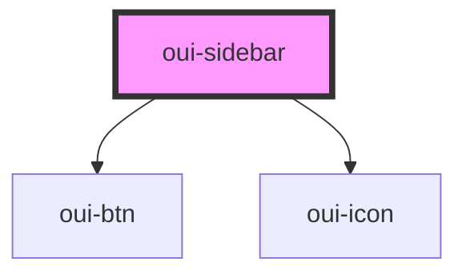

# oui-sidebar

<!-- Auto Generated Below -->

## Properties

| Property    | Attribute    | Description | Type     | Default  |
| ----------- | ------------ | ----------- | -------- | -------- |
| `menuTitle` | `menu-title` |             | `string` | `"Menu"` |

## Dependencies

### Depends on

- [oui-btn](../oui-btn)
- [oui-icon](../oui-icon)

### Graph

----------------------------------------------

*Built with [StencilJS](https://stenciljs.com/)*
