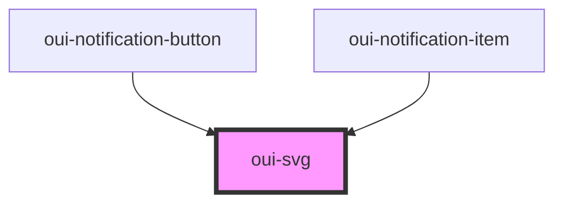

# oui-svg

## Icons

  * logo
  * logo-light-bg
  * icon-close
  * icon-filter

## Usage

```html
 <oui-svg name="logo" scale={1}></oui-svg>
```

<!-- Auto Generated Below -->


## Properties

| Property | Attribute | Description | Type               | Default     |
| -------- | --------- | ----------- | ------------------ | ----------- |
| `name`   | `name`    |             | `number \| string` | `undefined` |
| `scale`  | `scale`   |             | `number`           | `1.0`       |


## Dependencies

### Used by

 - [oui-notification-button](../notification-tray/button)
 - [oui-notification-item](../notification-item)

### Graph


----------------------------------------------

*Built with [StencilJS](https://stenciljs.com/)*
